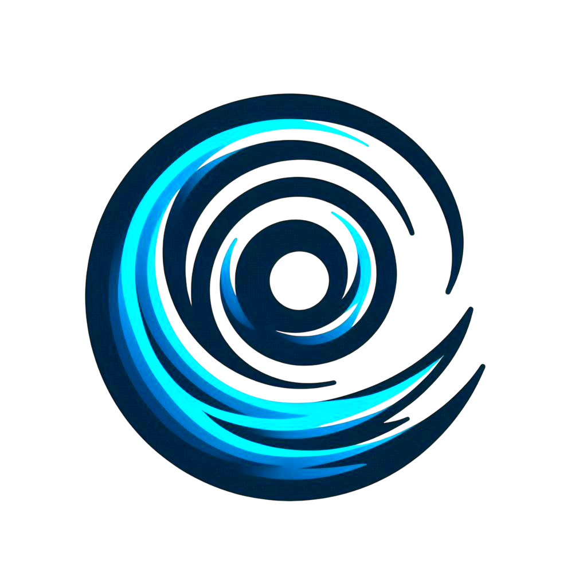

<a id="readme-top"></a>

[![Contributors][contributors-shield]][contributors-url]
[![Forks][forks-shield]][forks-url]
[![Stargazers][stars-shield]][stars-url]
[![Issues][issues-shield]][issues-url]
[![MIT License][license-shield]][license-url]
[![LinkedIn][linkedin-shield]][linkedin-url]

<!-- PROJECT LOGO -->
<br />
<div align="center">
  <a href="https://github.com/jayshiai/Cyclone">
    
  </a>

  <h3 align="center">Cyclone</h3>

  <p align="center">
    A programming language that's both Compiled and Interpreted!
    <br />
    <a href="https://cy.3dubs.in"><strong>Explore the docs »</strong></a>
    <br />
    <br />
    <a href="https://cy.3dubs.in/demo">View Demo</a>
    ·
    <a href="https://github.com/jayshiai/Cyclone/issues/new?labels=bug&template=bug-report---.md">Report Bug</a>
    ·
    <a href="https://github.com/jayshiai/Cyclone/issues/new?labels=enhancement&template=feature-request---.md">Request Feature</a>
  </p>
</div>

<!-- TABLE OF CONTENTS -->
<details>
  <summary>Table of Contents</summary>
  <ol>
    <li>
      <a href="#about-the-project">About The Project</a>
      <ul>
        <li><a href="#built-with">Built With</a></li>
      </ul>
    </li>
    <li>
      <a href="#getting-started">Getting Started</a>
      <ul>
        <li><a href="#installation">Installation</a></li>
        <li><a href="#usage">Usage</a></li>
      </ul>
    </li>
    <li><a href="#roadmap">Roadmap</a></li>
    <li><a href="#contributing">Contributing</a></li>
    <li><a href="#license">License</a></li>
    <li><a href="#contact">Contact</a></li>
    <li><a href="#acknowledgments">Acknowledgments</a></li>
  </ol>
</details>

<!-- ABOUT THE PROJECT -->

## About The Project

**Cyclone** is a minimalistic, type-safe compiled and interpreted ( yes, both! ) programming language for The Tarnished

### Built With

[![C++][C++]][cpp-url]

<p align="right">(<a href="#readme-top">back to top</a>)</p>

<!-- GETTING STARTED -->

## Getting Started

### Installation

1. Download the binaries from releate page.
2. Start using the complier and interpreter! Its that easy!

<p align="right">(<a href="#readme-top">back to top</a>)</p>

<!-- USAGE EXAMPLES -->

### Usage

```javascript
print("Hello World!\n");
var name = input();
print("I am " + name);
```

Compile:

```bash
./cycompiler <filepath> -o <outputpath>
```

Interpreter:

```bash
./cyinterpreter <filepath>
```

_For more examples, please refer to the [Documentation](https://cy.3dubs.in)_

<p align="right">(<a href="#readme-top">back to top</a>)</p>

<!-- ROADMAP -->

## Roadmap

- [x] Create Lexer
- [x] Add Diagnostics
- [x] Create Syntax Tree
- [x] Parse Syntax Tree
- [x] Build AST
- [x] Create Binder
- [x] Bind BST
- [x] Create Evaluator
- [x] Integrate Evaluator
- [x] Create Compilation Unit
- [x] Support Mulitple Files
- [x] Add Control Flow Analysis
- [x] Generate Compiler Binaries
- [x] Generate Interpreter Binaries
- [ ] Emit Assembly
- [ ] Support Compilation directly to native executable

See the [open issues](https://github.com/jayshiai/Cyclone/issues) for a full list of proposed features (and known issues).

<p align="right">(<a href="#readme-top">back to top</a>)</p>

<!-- CONTRIBUTING -->

## Contributing

Contributions are what make the open source community such an amazing place to learn, inspire, and create. Any contributions you make are **greatly appreciated**.

If you have a suggestion that would make this better, please fork the repo and create a pull request. You can also simply open an issue with the tag "enhancement".
Don't forget to give the project a star! Thanks again!

1. Fork the Project
2. Create your Feature Branch (`git checkout -b feature/AmazingFeature`)
3. Commit your Changes (`git commit -m 'Add some AmazingFeature'`)
4. Push to the Branch (`git push origin feature/AmazingFeature`)
5. Open a Pull Request

<p align="right">(<a href="#readme-top">back to top</a>)</p>

<!-- LICENSE -->

## License

Distributed under the MIT License. See `LICENSE` for more information.

<p align="right">(<a href="#readme-top">back to top</a>)</p>

<!-- CONTACT -->

## Contact

Jayvardhan Patil - [@jayshiai](https://www.reddit.com/user/jayshiai/) - jayshiai7811@gmail.com

Project Link: [https://github.com/jayshiai/Cyclone](https://github.com/jayshiai/Cyclone)

<p align="right">(<a href="#readme-top">back to top</a>)</p>

<!-- ACKNOWLEDGMENTS -->

## Acknowledgments

<p align="right">(<a href="#readme-top">back to top</a>)</p>

<!-- MARKDOWN LINKS & IMAGES -->
<!-- https://www.markdownguide.org/basic-syntax/#reference-style-links -->

[contributors-shield]: https://img.shields.io/github/contributors/jayshiai/Cyclone?style=plastic
[contributors-url]: https://github.com/jayshiai/Cyclone/graphs/contributors
[forks-shield]: https://img.shields.io/github/forks/jayshiai/Cyclone?style=plastic
[forks-url]: https://github.com/jayshiai/Cyclone/network/members
[stars-shield]: https://img.shields.io/github/stars/jayshiai/Cyclone.svg?style=plastic
[stars-url]: https://github.com/jayshiai/Cyclone/stargazers
[issues-shield]: https://img.shields.io/github/issues/jayshiai/Cyclone.svg?style=plastic
[issues-url]: https://github.com/jayshiai/Cyclone/issues
[license-shield]: https://img.shields.io/github/license/jayshiai/Cyclone.svg?style=plastic
[license-url]: https://github.com/jayshiai/Cyclone/blob/master/LICENSE
[linkedin-shield]: https://img.shields.io/badge/-LinkedIn-black.svg?style=plastic&logo=linkedin&colorB=555
[linkedin-url]: https://www.linkedin.com/in/jayvardhan-patil-419b9926b/
[cpp-url]: https://isocpp.org/
[C++]: https://img.shields.io/badge/c++-00599C?style=for-the-badge&logo=cplusplus&logoColor=white
